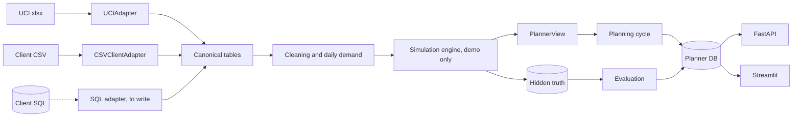

# QStats Demand & Inventory Planner

**Demand forecasting with rolling-origin model selection · stockout (censored-demand) reconstruction · probabilistic safety stock with lead-time uncertainty · replenishment, Amazon FBA and container decisions · controlled policy comparison · FastAPI + Streamlit + SQLAlchemy**

QStats Demand & Inventory Planner is a decision-support system for multi-channel e-commerce
companies. It combines demand forecasting, forecast uncertainty, inventory positions, supplier lead
times, purchasing constraints and unit economics to recommend what to buy, when to buy it and how
much, and to flag what should be moved, expedited, sent to Amazon or reviewed by a person.

The product is the inventory decision; the forecast is one input to it.


> **Demo data.** Historical demand patterns come from real transactions in the UCI Online Retail II
> dataset. The company, its warehouses, Amazon FBA, inventory, suppliers, lead times, purchase
> orders, costs and constraints are simulated. Details in [Data](#data-what-is-real-and-what-is-simulated).

## What this project covers

| Area | What is in the repo | Where to look |
|---|---|---|
| Censored demand | Detects stockout days from inventory snapshots, reconstructs demand with four transparent methods, and scores them against the hidden true demand in a controlled experiment | [`demand/reconstruction.py`](src/qstats_planner/demand/reconstruction.py), [`evaluation/benchmark.py`](src/qstats_planner/evaluation/benchmark.py) |
| Forecasting | 25 candidates (naive, moving average, SES, damped Holt, Croston, SBA, TSB, seasonal naive, ± a pooled seasonal prior); champion per segment by rolling-origin error of lead-time demand; a statsmodels ETS challenger | [`forecasting/`](src/qstats_planner/forecasting/) |
| Uncertainty | Empirical error quantiles pooled by segment and horizon; realised coverage measured and reported (the intervals run narrow) | [`forecasting/uncertainty.py`](src/qstats_planner/forecasting/uncertainty.py), [`evaluation/calibration.py`](src/qstats_planner/evaluation/calibration.py) |
| Inventory | Kaplan–Meier supplier lead times (open orders censored); demand over lead time + review as a mixture of lead-time and forecast-error distributions; order-up-to levels, MOQ and case-pack rounding; 180-day projection | [`inventory/`](src/qstats_planner/inventory/), [`replenishment/`](src/qstats_planner/replenishment/) |
| Decisions | Action center with nine action types (plus NO_ACTION), each with reason, evidence, expected effect, confidence and economic impact; Amazon FBA plan; container mix; planner overrides with an audit trail | [`replenishment/recommendations.py`](src/qstats_planner/replenishment/recommendations.py), [`optimization/containers.py`](src/qstats_planner/optimization/containers.py) |
| Evaluation | A legacy process and QStats run through the same simulated year from the same state; primary metric fixed in advance; efficiency frontier, 2×2×2 ablation, replicate worlds, sensitivity worlds | [`docs/EVAL_PLAN.md`](docs/EVAL_PLAN.md), [`evaluation/comparison.py`](src/qstats_planner/evaluation/comparison.py) |
| Engineering | Canonical data contract with source adapters (UCI, client CSV); planner code independent of the simulation (enforced by a test); SQLAlchemy schema portable to PostgreSQL / Azure SQL; FastAPI with OpenAPI docs; 11-view Streamlit app; 52 tests; CI with lint, tests, Docker build, secret scan | [`domain/`](src/qstats_planner/domain/), [`adapters/`](src/qstats_planner/adapters/), [`api/`](src/qstats_planner/api/main.py), [`dashboard/`](dashboard/), [`tests/`](tests/) |

## The problem

An importer buying from overseas factories orders 6 to 10 weeks before the goods can be sold. Three
things make that decision harder than it looks:

1. **Sales are not demand.** When a product is out of stock, recorded sales understate what
   customers wanted. A forecast built on those sales under-forecasts, the next order is too small,
   and the product runs out again.
2. **Lead times are uncertain.** The supplier's quote is a median at best. What matters for stock
   is the tail: how late the late orders are.
3. **The forecast is not the decision.** Purchasing needs a quantity that respects MOQ, case packs
   and container space, that covers Amazon separately, and that is worth its margin.

## What it does

```
real transaction patterns ─▶ demand history ─▶ inventory availability ─▶ stockout detection
  ─▶ demand reconstruction ─▶ forecast + uncertainty ─▶ lead-time demand ─▶ safety stock
  ─▶ forward inventory ─▶ replenishment decision ─▶ purchase / FBA action ─▶ economic outcome
```

Each week the planning cycle produces recommendations a buyer can act on. The plan in the app is
QStats's advice for the business **as the current process left it** on Sunday 7 Dec 2025 (the end of
the legacy world below). On that date 26 of 200 SKUs run out within eight weeks without action; the
plan buys $66.6k across 43 purchase lines (5 routed to a person: low forecast confidence or low
margin). By the plan's own model, the demand-weighted chance of covering lead-time demand goes from
88% to 97%; read that as an upper bound, because in the replay this model's intervals ran narrow.


Every recommendation answers what, why, with which evidence, with what expected effect and how
confident the plan is:


## Results

The same simulated business was run twice from the same day (2 Dec 2024): once with a
conventional legacy process, once with QStats. Same products, same real demand pattern, same
supplier delays. Scored on 168 SKUs over 8 Feb – 7 Dec 2025. The evaluation plan was committed
before the comparison was run; the comparison was rerun once after a logged code correction that
moved the results by less than a point ([`docs/EVAL_PLAN.md`](docs/EVAL_PLAN.md), change log).

| | Legacy (30 days of safety stock) | QStats |
|---|---|---|
| Fill rate | 82.0% | 88.7% |
| Lost contribution | $132.2k | $78.2k |
| Average inventory | $217.4k | $353.9k |
| Carrying cost (24% a year) | $43.3k | $70.5k |
| Inventory turns | 3.09 | 2.06 |
| Excess inventory at the end | $44.2k | $102.2k |
| One-week forecast WAPE | 0.623 | 0.633 |
| Forecast bias | −20.6% | −9.7% |

**In plain terms,** QStats ran the business like the current process with about 90 days of safety
stock instead of 30, on about 5% less inventory than that would take. Over the 303 scored days it
recovered $54.0k of contribution and saved $6.6k of cross-DC shipping, at $27.2k of extra carrying
cost: about +$33k, while ending with $58.0k more stock beyond 26 weeks of demand.

**At the service level the current process delivers, QStats did not save inventory.** The test fixed
in advance (inventory each policy needs for the legacy process's fill rate, read off its frontier):
QStats needed 2.6% *more* inventory (90% interval: from 6.5% less to 14.4% more; 1.0% more and 0.9%
less in two replicate worlds with different supplier luck). In 10.5% of the bootstrap resamples the
comparison fell outside QStats's frontier and is excluded from the interval.

**At higher service the direction favours QStats, but not conclusively.** To reach QStats's 88.7%
fill rate, the legacy rule needs 5.0% more inventory than QStats (90% interval −14.9% to +25.0%);
13.5% and 9.7% in the replicate worlds. Positive in all three worlds, not distinguishable from zero
in any one. Below about 86% fill the legacy curve is as good or slightly better:


What else the evidence says, without rounding up:

- **The legacy process with only a seasonal prior added matches or beats full QStats in two of three
  worlds** (+12.2% and +14.4% inventory efficiency against QStats's +5.0% and +9.7%; QStats leads in
  the third, +13.5% against +5.6%).
- **No ingredient helps alone.** The 25-model forecaster alone, stockout reconstruction alone and the
  prior alone add nothing or hurt; they help only in combination with reconstruction. Probabilistic
  safety stock learned from censored sales is worse than the 30-day rule (−3% to −30%).
- **QStats's own default targets are not its best setting.** In all three worlds a uniform 95%
  target beat the class targets it uses (A 97%, B 95%, C 90%): more fill with less stock.
- **Forecast accuracy did not improve** (one-week WAPE 0.633, 0.627, 0.625 against the legacy
  process's 0.623, 0.628, 0.626). Forecast bias was halved in all three worlds, which is what
  stockout correction is for.
- **Intervals run narrow.** The P90 of lead-time demand held 83.9% of outcomes and the P95 89.1%,
  worst in the peak season and for new products. This, and the inclusion of new products, dying
  products and never-stocked Amazon channels, is why realised fill (88.7%) sits below the 90–97%
  service targets, which measure something narrower (see the glossary).
- **QStats's edge does not come from modelling lead-time uncertainty.** In a sensitivity world where
  every order arrives exactly on its quote, QStats saved 8.7% at the legacy fill rate (interval 1.4%
  to 12.6%), more than in the base world.
- **A channel that was never stocked is invisible.** 12 of 70 Amazon-enabled SKUs never sold on
  Amazon in the QStats world (13 in the legacy world): no stock, no sales, so no demand signal for
  either planner (12,051 units of Amazon demand went unserved).

### Stockouts: sales are not demand

The real transaction history is treated as the demand a simulated business faced, and simulated
stockouts cut sales short (15,775 censored channel-days, 154,385 units of hidden lost demand).
Because the uncut series is kept aside, each reconstruction method can be scored against it.
Two-sided uses data before and after an episode (available afterwards); real time uses only the
data before it:

| Method | Episode error, two-sided (units) | Bias, two-sided | Lost demand recovered, two-sided | Recovered, real time |
|---|---|---|---|---|
| No adjustment | 229 | −229 | 0% | 0% |
| Pre/post velocity | 135 | −85 | 63% | 69% |
| Local level × weekday × season (used by the planner) | 130 | −78 | 66% | 76% |
| Smoothed level at episode start | 159 | −68 | 70% | 70% |
| Censored likelihood (gamma, EM) | 126 | −62 | 73% | 81% |

11% of the lost demand sits on Amazon channels that were never stocked, where no method can see
anything; on channels stocked at least once the planner's method recovers 74% (two-sided) and the
censored-likelihood method 82%. The planner's method was chosen on 120 separate development SKUs by
a rule fixed in advance; on these demo SKUs the censored-likelihood method scored better, and the app
says so. Every method still under-estimates: stockouts tend to start on busy days.


## How the two planners are built

The legacy process is what a careful team runs in a spreadsheet or an ERP module, not a straw man:

| | Legacy | QStats |
|---|---|---|
| Demand history | Sales as recorded | Sales, stockout days reconstructed |
| Forecast | Simple exponential smoothing, α = 0.2 (tuned on development SKUs), closed weeks skipped | Champion per segment among 25 candidates by rolling-origin error of lead-time demand |
| Seasonality | None | Pooled monthly prior from 1,508 other products, fixed before the replay |
| Lead time | Supplier quote, as if certain | Kaplan–Meier from receipts, open orders censored, shrunk toward the quote |
| Safety stock | 30 days of forecast demand | Service-level quantile of demand over lead time + review |
| Review, MOQ, case packs | Weekly, same rounding | Weekly, same rounding |
| Amazon FBA | Days of cover counting pick, transit and review time | Service-level quantile over the replenishment window, by inventory state |

Both see the same open purchase orders. The legacy rule's weakness in this test is specific: it
believes censored sales, ignores seasonality and treats the quote as certain.

## Data: what is real and what is simulated

| Layer | Content |
|---|---|
| Real (UCI Online Retail II) | Which product sold, on which day, how many units, at what price, to which customer ID |
| Transformed | Cleaning; daily series inside each product's active life; dates shifted forward 731 weeks (weekdays and seasons kept); customers assigned to a region and channel by a stable hash |
| Simulated | Two U.S. DCs and Amazon FBA, inventory, ten suppliers and their lead times, purchase orders, MOQ, case packs, cube, USD costs and margins, containers, promotions, gaps in the inventory feed |
| Hidden from the planner | True demand, lost sales, true lead-time parameters, promotion uplifts: used only to score |

Cleaning, with counts ([`docs/data_methodology.md`](docs/data_methodology.md)): exact duplicates,
adjustments, postage and fee lines and zero-price lines removed; returns never subtracted blindly
(a return that matches an earlier sale cancels that sale on the day it was placed: 6,179 of 17,914
return lines, 400,719 of 467,739 returned units; the rest stay returns on their own date); 159
exceptional wholesale lots left out of demand; lines without a customer kept. The source is a UK
giftware retailer with many wholesale customers, so demand is lumpier than a typical
direct-to-consumer seller's.

Demo SKUs (200) and development SKUs (120, disjoint) were chosen systematically: established
products using only the first 52 weeks of data, so they were not picked for how they behaved later;
new products drawn at random among week 53–80 launches, by launch date only.

## Glossary

| Term | Meaning here |
|---|---|
| Fill rate | Units sold ÷ units demanded (true demand, hidden from the planner) |
| Cycle service level | Chance that what is ordered now covers demand until the next order arrives; the targets (90–97%) are of this kind |
| Censored demand | Demand that could not be seen because the shelf was empty: sales show what was available, not what was wanted |
| WAPE | Sum of absolute forecast errors ÷ sum of demand (lower is better) |
| Forecast bias | Sum of forecast errors ÷ sum of demand; negative = forecasts too low |
| P90 | A quantity demand stays at or below 90% of the time |
| Rolling origin | Testing a forecast from many past dates, each using only the data available on that date |
| Frontier | Fill rate against average inventory as a policy's safety setting varies; up and to the left is better |
| Ablation | Switching each ingredient on and off to see which one does the work |
| Replicate world | The same business and demand with different supplier luck (another random seed) |
| Kaplan–Meier | A way to estimate a lead-time distribution that counts still-open orders as "at least this long" |
| Croston, SBA, TSB | Forecasting methods for products that sell on few weeks |

The app's headline figures describe today's business as the current process left it; the comparison
figures describe the replayed year in each world. They measure different things (for example the
app's forecast bias is the champions' backtest on reconstructed demand, −6.4%; the comparison's is
against true demand, −9.7%).

## Methodology

- [Forecasting](docs/forecasting_methodology.md): models and equations, why there is no per-SKU
  Holt-Winters, rolling-origin validation, segment-level selection, uncertainty and calibration.
- [Inventory](docs/inventory_methodology.md): inventory position by state, lead-time distribution,
  the lead-time-demand mixture, safety stock, order quantities, FBA, projections, recommendations,
  economic impact, containers.
- [Evaluation plan and results](docs/EVAL_PLAN.md), including every decision made on the
  development SKUs, the full ablation, known limitations and a dated change log.

## Architecture



The planner reads canonical tables only, never UCI column names, and does not import the
simulation (a test enforces both). One planning code path serves the weekly simulation, the live
plan and the scenario simulator. What a move to a client's PostgreSQL or Azure SQL system needs,
and what is not built yet, is in [`docs/client_onboarding.md`](docs/client_onboarding.md); more in
[`docs/architecture.md`](docs/architecture.md).

## Run it

Requires Python 3.12 and [uv](https://docs.astral.sh/uv/).

```bash
make demo
```

downloads and verifies the UCI file, cleans it, selects the SKUs, runs the simulation and the
policy comparison, builds the SQLite database, runs the planning cycle and opens the app (about
six minutes on a laptop from a fresh clone; the comparison uses eight processes). Step by step:

```bash
uv sync
uv run python scripts/download_data.py          # or place online_retail_ii.zip in data/raw/
uv run python scripts/prepare_transactions.py
uv run python scripts/build_demo_population.py
uv run python scripts/simulate_supply_chain.py  # the EVAL_PLAN comparison commands + the benchmark
uv run python scripts/initialize_db.py
uv run python scripts/run_planning_cycle.py
uv run streamlit run dashboard/streamlit_app.py # the app
uv run uvicorn qstats_planner.api.main:app      # the API, docs at /docs
uv run pytest -q
```

`scripts/tune_dev.py` reproduces the development decisions; `scripts/evaluate_policies.py` runs
the comparison on either population. A clean clone reproduced the reported results exactly. CI runs
lint, the unit tests and a Docker build; the tests that check the README's numbers and the API need
the pipeline's outputs and run locally after `make demo`.

## Limitations

- **The operations are simulated.** The results show what the methods do inside a controlled
  world built around real demand. They say nothing about the original retailer and are not a
  forecast of savings for any company.
- **The evidence is thin.** One demand path; three replicate worlds; neither matched metric is
  distinguishable from zero; the SKU bootstrap ignores that SKUs share suppliers, so its intervals
  are probably too narrow; the pre-registration is a local git commit without an external timestamp.
- **Two years of weekly data.** Seasonality is a pooled prior, not estimated per product.
- **Intervals are too narrow,** especially in the peak season and for new products.
- **Never-stocked channels stay dark**: no rule yet launches an Amazon-enabled product on Amazon
  without sales history there.
- **Simplifications:** inter-DC transfers, expedites and container consolidation are
  recommendations, not simulated; cross-DC fulfilment is allowed at a fixed extra cost; FBA has no
  capacity limits or fee schedule beyond a per-unit cost; promotions have a random uplift and no
  price elasticity; costs, margins and service targets are fictional USD values.
- **Demo engineering:** planner decisions are stored with a free-text planner name and no
  authentication; intermediate simulation state is pickled and regenerated by the pipeline, not a
  storage format.

## Roadmap

1. Recalibrate intervals by season and segment (the measured under-coverage), with errors from
   windows other than those used to select the champion.
2. Set service targets by margin instead of by revenue class (a uniform 95% already did better).
3. A channel-launch rule for Amazon-enabled products with no Amazon history.
4. Test the censored-likelihood reconstruction in the planner (it scored better on the demo SKUs).
5. A global gradient-boosting challenger with lag and calendar features.
6. Simulate inter-DC transfers and expedites in the closed loop; container consolidation as an
   integer programme (OR-Tools) behind the existing interface.
7. A SQL adapter and a `PlannerView` built from a client's tables.

## Data and licence

Chen, D. (2012). *Online Retail II* [Dataset]. UCI Machine Learning Repository.
https://doi.org/10.24432/C5CG6D. Licensed under [CC BY 4.0](https://creativecommons.org/licenses/by/4.0/).
This project cleaned, aggregated, re-dated and re-channelled it as described above
([`DATA.md`](DATA.md)). IBM Plex fonts: SIL Open Font License ([`dashboard/static/fonts/LICENSE.txt`](dashboard/static/fonts/LICENSE.txt)).
Code: MIT ([`LICENSE`](LICENSE)).

## About

A dated portfolio demo by QStats, built in October 2026 on public data. It is not client work and
has not been used in production.
