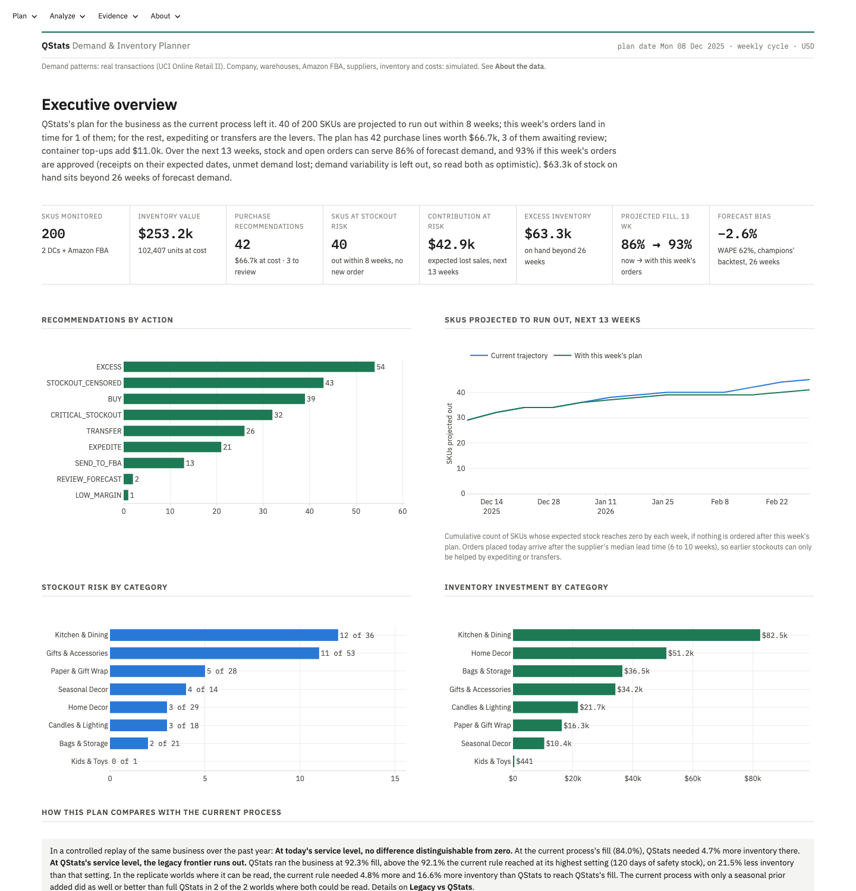
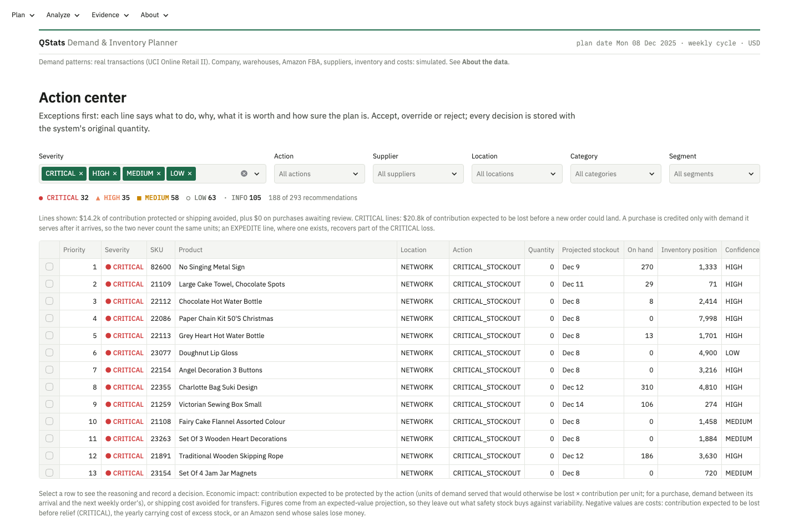
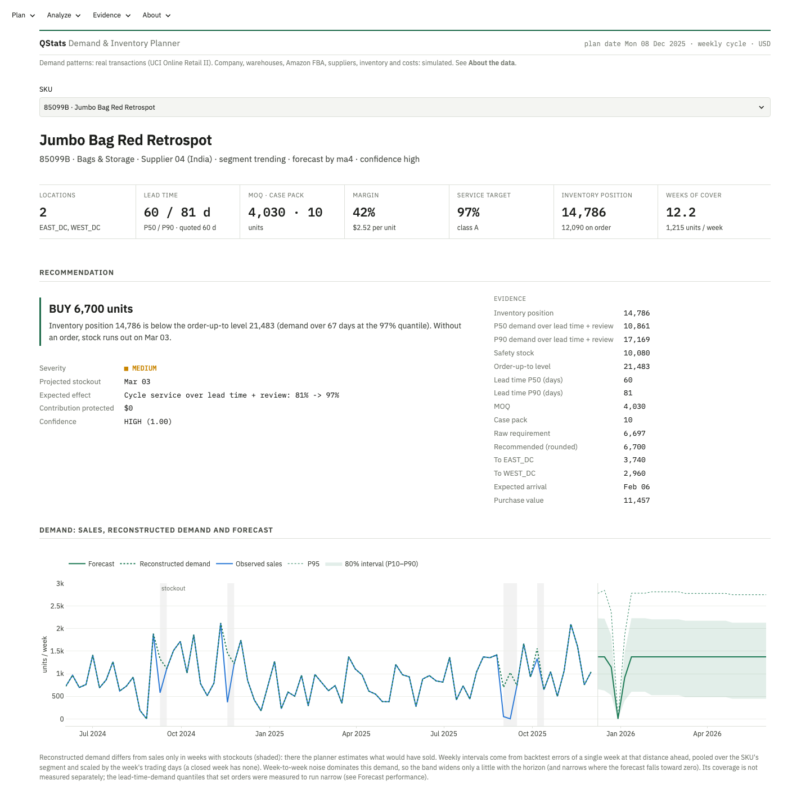
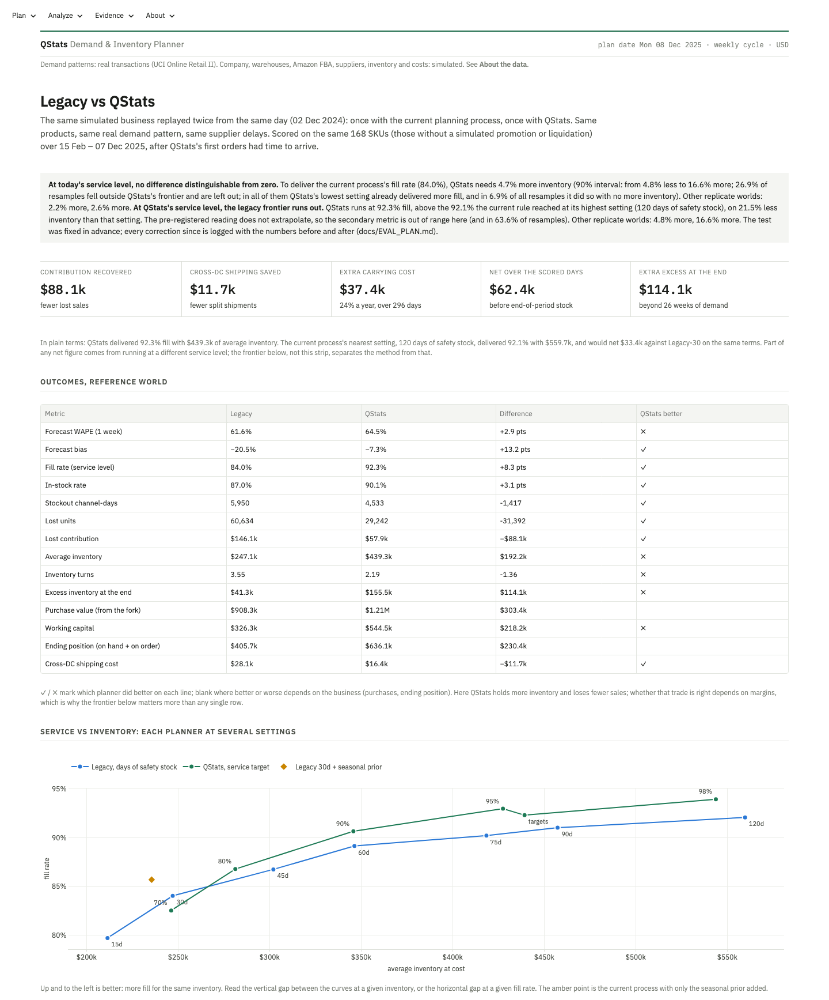
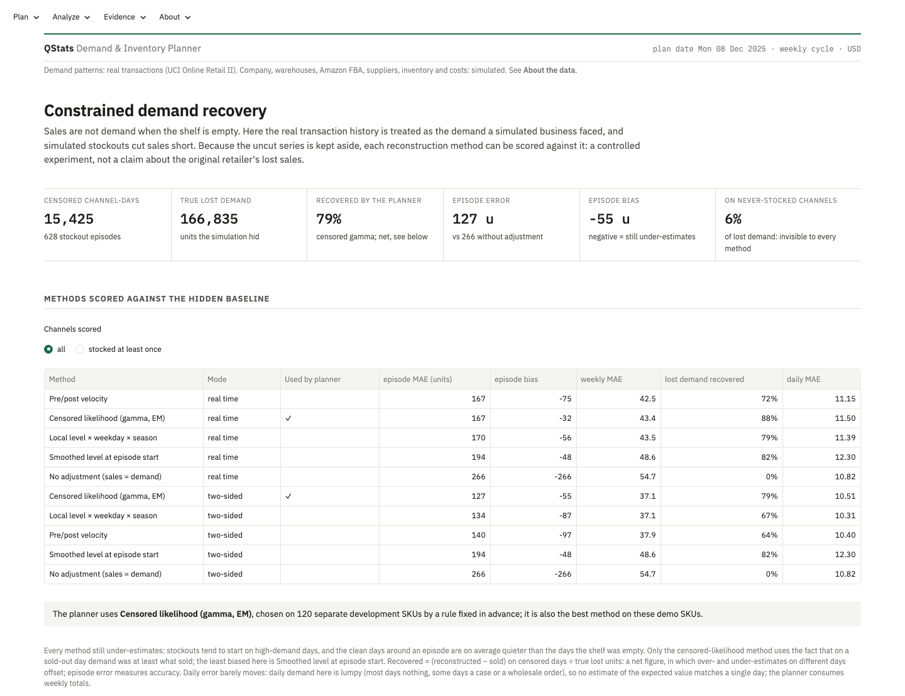
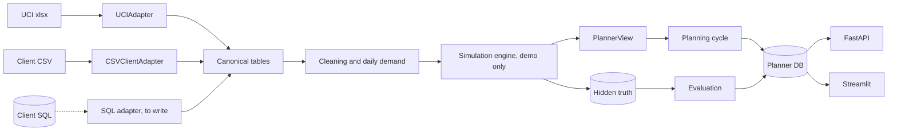

# QStats Demand & Inventory Planner

**Demand forecasting with rolling-origin model selection · stockout (censored-demand) reconstruction · probabilistic safety stock with lead-time uncertainty · replenishment, Amazon FBA and container decisions · controlled policy comparison · FastAPI + Streamlit + SQLAlchemy**

QStats Demand & Inventory Planner is a decision-support system for multi-channel e-commerce
companies. It combines demand forecasting, forecast uncertainty, inventory positions, supplier lead
times, purchasing constraints and unit economics to recommend what to buy, when to buy it and how
much, and to flag what should be moved, expedited, sent to Amazon or reviewed by a person.

The product is the inventory decision; the forecast is one input to it.



> **Demo data.** Historical demand patterns come from real transactions in the UCI Online Retail II
> dataset. The company, its warehouses, Amazon FBA, inventory, suppliers, lead times, purchase
> orders, costs and constraints are simulated. Details in [Data](#data-what-is-real-and-what-is-simulated).

## What this project covers

| Area | What is in the repo | Where to look |
|---|---|---|
| Censored demand | Detects stockout days from inventory snapshots, reconstructs demand with four transparent methods, and scores them against the hidden true demand in a controlled experiment | [`demand/reconstruction.py`](src/qstats_planner/demand/reconstruction.py), [`evaluation/benchmark.py`](src/qstats_planner/evaluation/benchmark.py) |
| Forecasting | 25 candidates (naive, moving average, SES, damped Holt, Croston, SBA, TSB, seasonal naive, ± a pooled seasonal prior); champion per segment by rolling-origin error of lead-time demand, with a SKU-level override; a statsmodels ETS challenger on the same input, scored out of sample (it beat the champions) | [`forecasting/`](src/qstats_planner/forecasting/) |
| Uncertainty | Empirical error quantiles pooled by segment and horizon, for demand over lead time + review and for each week ahead; realised coverage measured and reported (the intervals run narrow) | [`forecasting/uncertainty.py`](src/qstats_planner/forecasting/uncertainty.py), [`evaluation/calibration.py`](src/qstats_planner/evaluation/calibration.py) |
| Inventory | Kaplan–Meier supplier lead times (open orders censored); demand over lead time + review as a mixture of lead-time and forecast-error distributions; order-up-to levels, MOQ and case-pack rounding; 180-day projection | [`inventory/`](src/qstats_planner/inventory/), [`replenishment/`](src/qstats_planner/replenishment/) |
| Decisions | Action center with nine action types (plus NO_ACTION), each with reason, evidence, expected effect, confidence and economic impact; Amazon FBA plan; container mix; planner overrides with an audit trail | [`replenishment/recommendations.py`](src/qstats_planner/replenishment/recommendations.py), [`optimization/containers.py`](src/qstats_planner/optimization/containers.py) |
| Evaluation | A legacy process and QStats run through the same simulated year from the same state; primary metric fixed in advance; efficiency frontier, 2×2×2 ablation, replicate worlds, sensitivity worlds | [`docs/EVAL_PLAN.md`](docs/EVAL_PLAN.md), [`evaluation/comparison.py`](src/qstats_planner/evaluation/comparison.py) |
| Engineering | Canonical data contract with source adapters (UCI, client CSV); planner code independent of the simulation (enforced by tests); SQLAlchemy schema with portable types (only SQLite has been run); FastAPI with OpenAPI docs; 11-view Streamlit app; 57 tests; CI with lint, tests, Docker build, secret scan | [`domain/`](src/qstats_planner/domain/), [`adapters/`](src/qstats_planner/adapters/), [`api/`](src/qstats_planner/api/main.py), [`dashboard/`](dashboard/), [`tests/`](tests/) |

## The problem

An importer buying from overseas factories orders 6 to 10 weeks before the goods can be sold. Three
things make that decision harder than it looks:

1. **Sales are not demand.** When a product is out of stock, recorded sales understate what
   customers wanted. A forecast built on those sales under-forecasts, the next order is too small,
   and the product runs out again.
2. **Lead times are uncertain.** The supplier's quote is a median at best. What matters for stock
   is the tail: how late the late orders are.
3. **The forecast is not the decision.** Purchasing needs a quantity that respects MOQ, case packs
   and container space and that covers Amazon separately. QStats rounds orders up to MOQ and case
   pack and sends low-margin lines to a person; it does not yet weigh an MOQ-inflated order against
   what the extra units cost to carry.

## What it does

```
real transaction patterns ─▶ demand history ─▶ inventory availability ─▶ stockout detection
  ─▶ demand reconstruction ─▶ forecast + uncertainty ─▶ lead-time demand ─▶ safety stock
  ─▶ forward inventory ─▶ replenishment decision ─▶ purchase / FBA action ─▶ economic outcome
```

Each week the planning cycle produces recommendations a buyer can act on. The plan in the app is
QStats's advice for the business **as the current process left it** on Sunday 7 Dec 2025 (the end of
the legacy world below). On that date 40 of 200 SKUs are projected to run out within eight weeks;
this week's orders land in time for 1 of them, so expediting and transfers are the levers there.
The plan has 42 purchase lines worth $66.7k (3 routed to a person: low forecast confidence or low
margin), and container top-ups add $11.0k. Over the next 13 weeks, stock and open orders can serve
86% of forecast demand, and 93% if this week's orders are approved. That projection puts receipts
on their expected dates and loses unmet demand, but holds demand at its forecast, so read both
figures as optimistic.



Every recommendation answers what, why, with which evidence, with what expected effect and how
confident the plan is:



## Results

The same simulated business was run twice from the same day (2 Dec 2024): once with a
conventional legacy process, once with QStats. Same products, same real demand pattern, same
supplier delays. Scored on 168 SKUs over 15 Feb – 7 Dec 2025 (296 days). The evaluation plan was
committed before the comparison was run. Four rounds of corrections since, each followed by a full
rerun, are logged with the numbers before and after ([`docs/EVAL_PLAN.md`](docs/EVAL_PLAN.md),
change log). The third fixed a SKU-selection bug that redrew 94 of the 200 SKUs, and re-applying
the pre-set development rule switched the stockout reconstruction method, so these are not the
first run's numbers.

| | Legacy (30 days of safety stock) | QStats |
|---|---|---|
| Fill rate | 84.0% | 92.3% |
| Lost contribution | $146.1k | $57.9k |
| Average inventory | $247.1k | $439.3k |
| Carrying cost (24% a year, 296 days) | $48.1k | $85.5k |
| Inventory turns | 3.55 | 2.19 |
| Excess inventory at the end | $41.3k | $155.5k |
| One-week forecast WAPE | 0.616 | 0.645 |
| Forecast bias | −20.5% | −7.3% |

**In plain terms,** QStats ran the business at about the fill rate the current process reaches with
120 days of safety stock instead of 30 (92.1% with $559.7k), on 21.5% less inventory than that.
Against the 30-day process, over the 296 scored days, it recovered $88.1k of contribution and saved
$11.7k of cross-DC shipping, at $37.4k of extra carrying cost: about +$62k, while ending with
$114.1k more stock beyond 26 weeks of demand. About half of that net comes from the higher service
level alone: the current process at 120 days would net about +$33k against its 30-day self on the
same terms.

**At the service level the current process delivers, QStats did not save inventory.** The test fixed
in advance (inventory each policy needs for the legacy process's fill rate, read off its frontier):
QStats needed 4.7% *more* inventory (90% interval: from 4.8% less to 16.6% more; 2.2% more and 2.6%
more in two replicate worlds with different supplier luck). In 26.9% of the bootstrap resamples the
comparison fell outside QStats's frontier and is left out of the interval: in every one of them even
QStats's lowest setting (a 70% target) delivered more fill than the current process, and in 69 of
the 1,000 it did so with no more inventory.

**At QStats's service level, the legacy frontier runs out.** QStats delivered 92.3% fill; the
current rule's highest tested setting, 120 days of safety stock, reached 92.1% and held 27.4% more
inventory than QStats. Because 92.3% lies beyond the end of the legacy frontier, the pre-registered
secondary metric (inventory the legacy rule needs at QStats's fill) is out of range in the reference
world, as it is in 63.6% of its resamples; in the two replicate worlds the legacy rule needed 4.8%
more and 16.6% more inventory than QStats. In the reference world the curves cross near 85% fill:
below it the legacy curve is as good or better, above it QStats holds less stock for the same fill.



What else the evidence says, without rounding up:

- **Adding only the seasonal prior to the legacy process is the strongest single change.** Its
  inventory efficiency against the legacy frontier is +19.2%, +20.4% and +24.3% in the three worlds.
  Full QStats can be read in two of them (+4.8% and +16.6%), and the prior-only change beats it in
  both.
- **Inside QStats, no ingredient helps on its own.** Reconstruction alone costs 1–7% efficiency.
  Probabilistic safety stock learned from raw, censored sales (with Kaplan–Meier lead times and
  QStats's Amazon rule, which the same switch brings in) scores −44.9% to −48.5%. The forecaster
  alone delivers less fill than the legacy rule at 15 days with more inventory, and so does the
  prior inside QStats's forecaster in two of three worlds (−14.0% in the third). Combined with
  reconstruction, the prior helps in all three worlds and probabilistic safety stock in one.
- **QStats's own default targets are not its best setting.** In all three worlds a uniform 95%
  target beat the class targets it uses (A 97%, B 95%, C 90%): more fill with less stock.
- **Forecast accuracy got slightly worse.** One-week WAPE 0.645, 0.653 and 0.651 against the legacy
  process's 0.616, 0.621 and 0.622. Forecast bias fell from about −20% to about −7% in all three
  worlds, which is what stockout correction is for.
- **The model selection did worse out of sample than an ETS challenger.** An ETS(A, Ad, N) fitted
  per SKU by maximum likelihood, on the same prior-adjusted input the candidates use and scored
  against the champion each SKU had 26 weeks before the plan date, had a scaled error of 0.507
  against the champions' 0.660 (700 windows, 182 SKUs); the champions were better only for trending
  and volatile SKUs. 139 of 200 SKUs run on their own SKU-level pick among 25 candidates, which
  suggests that override is fitting noise.
- **Intervals run narrow.** The P90 of lead-time demand held 84.1% of outcomes and the P95 89.2%,
  worst for new products (P90 57.9%) and in the peak season (P95 85.0%).
- **QStats's edge does not come from modelling lead-time uncertainty.** In a sensitivity world where
  every order arrives exactly on its quote, QStats saved 5.3% at the legacy fill rate (interval from
  6.0% more to 12.6% less), and the legacy rule needed 39.5% more inventory to reach QStats's fill
  (interval +12.1% to +59.3%): more favourable to QStats than the base world.
- **A channel that never sells is invisible.** 17 of 72 Amazon-enabled SKUs never sold on Amazon after
  the fork in the QStats world (18 in the legacy world); 15 of them had Amazon demand, 7,884 units that
  went unserved, which neither planner could see.

### Stockouts: sales are not demand

The real transaction history is treated as the demand a simulated business faced, and simulated
stockouts cut sales short (15,425 censored channel-days in 628 episodes, 166,835 units of hidden
lost demand). Because the uncut series is kept aside, each reconstruction method can be scored
against it. Two-sided uses data before and after an episode (available afterwards); real time uses
only the data before it:

| Method | Episode error, two-sided (units) | Bias, two-sided | Lost demand recovered, two-sided | Recovered, real time |
|---|---|---|---|---|
| No adjustment | 266 | −266 | 0% | 0% |
| Pre/post velocity | 140 | −97 | 64% | 72% |
| Local level × weekday × season | 134 | −87 | 67% | 79% |
| Smoothed level at episode start | 194 | −48 | 82% | 82% |
| Censored likelihood (gamma, EM; used by the planner) | 127 | −55 | 79% | 88% |

The planner's method was chosen on 120 separate development SKUs by a rule fixed in advance
(lowest two-sided episode error); on these demo SKUs it also has the lowest episode error. Recovered
is a net figure: over- and under-estimates on different days offset, so episode error is the
accuracy measure. 5.8% of the lost demand sits on Amazon channels that were never stocked, where no
method can see anything; on channels stocked at least once the planner's method recovers 84%
(two-sided). Every method still under-estimates: stockouts tend to start on busy days.



## How the two planners are built

The legacy process is what a careful team runs in a spreadsheet or an ERP module, not a straw man:

| | Legacy | QStats |
|---|---|---|
| Demand history | Sales as recorded | Sales, with stockout days reconstructed (sold-out days treated as a lower bound on demand) |
| Forecast | Simple exponential smoothing, α = 0.2 (tuned on development SKUs), closed weeks skipped | Champion per segment among 25 candidates by rolling-origin error of lead-time demand; a SKU keeps its own pick when it beats the segment's by 15% on 3+ non-overlapping windows |
| Seasonality | None | Pooled monthly prior from 1,490 other products (1,419 general, 71 Christmas-type), built from the first year only |
| Lead time | Supplier quote, as if certain | Kaplan–Meier from receipts, open orders censored, shrunk toward the quote |
| Safety stock | 30 days of forecast demand | Service-level quantile of demand over lead time + review |
| Review, MOQ, case packs | Weekly, same rounding | Weekly, same rounding |
| Amazon FBA | Days of cover counting pick, transit and review time | Service-level quantile over the replenishment window, by inventory state |

Both see the same open purchase orders. The legacy rule's weakness in this test is specific: it
believes censored sales, ignores seasonality, treats the quote as certain and counts every unit at
Amazon, reserved ones included, as available.

## Data: what is real and what is simulated

| Layer | Content |
|---|---|
| Real (UCI Online Retail II) | Which product sold, on which day, how many units, at what price, to which customer ID |
| Transformed | Cleaning; daily series inside each product's active life; dates shifted forward 731 weeks (weekdays and seasons kept); customers assigned to a region and channel by a stable hash |
| Simulated | Two U.S. DCs and Amazon FBA, inventory, ten suppliers and their lead times, purchase orders, MOQ, case packs, cube, USD costs and margins, containers, promotions, gaps in the inventory feed |
| Hidden from the planner | True demand, lost sales, true lead-time parameters, promotion uplifts: used only to score |

Cleaning, with counts ([`docs/data_methodology.md`](docs/data_methodology.md)): exact duplicates,
adjustments, postage and fee lines and zero-price lines removed; returns never subtracted blindly
(a return that matches an earlier sale cancels that sale on the day it was placed: 6,179 of 17,914
return lines, 400,719 of 467,739 returned units; the rest stay returns on their own date); 159
exceptional wholesale lots left out of demand; lines without a customer kept. The source is a UK
giftware retailer with many wholesale customers, so demand is lumpier than a typical
direct-to-consumer seller's.

Demo SKUs (200) and development SKUs (120, disjoint) were chosen systematically: established
products using only the first 52 weeks of data, so they were not picked for how they behaved later;
new products drawn at random among week 53–80 launches, by launch date only.

## Glossary

| Term | Meaning here |
|---|---|
| DC | Distribution centre (here EAST_DC and WEST_DC) |
| FBA | Fulfilment by Amazon: stock held and shipped by Amazon |
| MOQ | Minimum order quantity a supplier accepts |
| Order-up-to level | The inventory position an order tops up to; here the service-level quantile of demand over lead time + review |
| Champion | The forecasting model chosen for a segment (or kept by a SKU) by its backtest error |
| Scaled error | Absolute error of total demand over the protection interval ÷ (the SKU's mean weekly units × weeks); 0.5 means off by half a typical interval's demand |
| ETS | Exponential smoothing state-space model (statsmodels), here with additive damped trend |
| EM | Expectation–maximisation: alternately estimate the censored values and the model until they agree |
| Fill rate | Units sold ÷ units demanded (true demand, hidden from the planner) |
| Inventory efficiency | Inventory the legacy rule needs to reach a policy's fill rate ÷ that policy's own inventory − 1; positive = less stock for the same service |
| Out of range | A fill rate beyond the ends of the frontier it is read on; the comparison does not extrapolate, so no value is reported |
| Episode | A run of consecutive stockout days for one SKU and channel |
| Cycle service level | Chance that what is ordered now covers demand until the next order arrives; the targets (90–97%) are of this kind |
| Censored demand | Demand that could not be seen because the shelf was empty: sales show what was available, not what was wanted |
| WAPE | Sum of absolute forecast errors ÷ sum of demand (lower is better) |
| Forecast bias | Sum of forecast errors ÷ sum of demand; negative = forecasts too low |
| P90 | A quantity demand stays at or below 90% of the time |
| Rolling origin | Testing a forecast from many past dates, each using only the data available on that date |
| Frontier | Fill rate against average inventory as a policy's safety setting varies; more fill for less inventory (up and to the left) is better |
| Ablation | Switching each ingredient on and off to see which one does the work |
| Replicate world | The same business and demand with different supplier luck (another random seed) |
| Kaplan–Meier | A way to estimate a lead-time distribution that counts still-open orders as "at least this long" |
| Croston, SBA, TSB | Forecasting methods for products that sell on few weeks |

The app's headline figures describe today's business as the current process left it; the comparison
figures describe the replayed year in each world. They measure different things (for example the
app's forecast bias is the champions' backtest on reconstructed demand, −2.6%; the comparison's is
against true demand, −7.3%).

## Methodology

- [Forecasting](docs/forecasting_methodology.md): models and equations, why there is no per-SKU
  Holt-Winters, rolling-origin validation, segment-level selection, uncertainty and calibration.
- [Inventory](docs/inventory_methodology.md): inventory position by state, lead-time distribution,
  the lead-time-demand mixture, safety stock, order quantities, FBA, projections, recommendations,
  economic impact, containers.
- [Evaluation plan and results](docs/EVAL_PLAN.md), including every decision made on the
  development SKUs, the full ablation, known limitations and a dated change log.

## Architecture



The planner reads a `PlannerView` ([`domain/view.py`](src/qstats_planner/domain/view.py)), which today
only the simulation builds; adapters turn a source into canonical tables, and a constructor that
builds the view from a client's tables is the main piece not written yet. No planner module names a
UCI column or imports the simulation (tests enforce both). One planning code path serves the weekly
simulation, the live plan and the scenario simulator. The schema uses portable SQLAlchemy types, but only SQLite has
been run, and the planner assumes the demo's network of two DCs plus Amazon FBA. What a move to a
client's PostgreSQL or Azure SQL system needs, and what is not built yet, is in
[`docs/client_onboarding.md`](docs/client_onboarding.md); more in
[`docs/architecture.md`](docs/architecture.md).

## Run it

Requires Python 3.12 and [uv](https://docs.astral.sh/uv/).

```bash
make demo
```

downloads and verifies the UCI file, cleans it, selects the SKUs, runs the simulation and the
policy comparison, builds the SQLite database, runs the planning cycle and starts the app at
http://localhost:8501 (open it in a browser; the server runs headless). On a laptop with 8 cores and
8 GB of memory the whole run takes about ten minutes. The comparison runs parallel processes of
about 1 GB each, by default min(8, CPUs, 75% of memory / 1.2 GB); `make demo WORKERS=4` uses fewer. Step by
step:

```bash
uv sync
uv run python scripts/download_data.py          # or place online_retail_ii.zip in data/raw/
uv run python scripts/prepare_transactions.py
uv run python scripts/build_demo_population.py
uv run python scripts/simulate_supply_chain.py  # the EVAL_PLAN comparison commands + the benchmark
uv run python scripts/initialize_db.py
uv run python scripts/run_planning_cycle.py
uv run streamlit run dashboard/streamlit_app.py # the app
uv run uvicorn qstats_planner.api.main:app      # the API, docs at /docs
uv run pytest -q
```

`scripts/tune_dev.py` reproduces the two tuned development settings (the legacy smoothing constant
and the reconstruction method); the other development decisions are recorded in
[`docs/EVAL_PLAN.md`](docs/EVAL_PLAN.md) but not scripted. `scripts/evaluate_policies.py` runs the
comparison on either population. A clean clone reproduced the reported results exactly. CI runs
lint, the unit tests and a Docker build; the tests that check the README's numbers and the API need
the pipeline's outputs and run locally after `make demo`.

## Limitations

- **The operations are simulated.** The results show what the methods do inside a controlled
  world built around real demand. They say nothing about the original retailer and are not a
  forecast of savings for any company.
- **The evidence is thin.** One demand path; three replicate worlds; the primary metric is not
  distinguishable from zero and the secondary is out of range in the reference world; 27% of the
  primary's resamples fall outside the frontier; the SKU bootstrap ignores that SKUs share
  suppliers, so its intervals are probably too narrow; the pre-registration is a local git commit
  without an external timestamp.
- **The reported numbers follow four rounds of corrections.** Each is logged with its effect; the
  third redrew 94 of the 200 SKUs and changed the reconstruction method.
- **The SKU-level model override probably overfits.** 139 of 200 SKUs use it, and out of sample a
  per-SKU ETS beat the selected champions.
- **The replay approves everything.** It places every order and Amazon send the plan sizes,
  including the lines the live plan holds for a person, and no container top-ups.
- **Two years of weekly data.** Seasonality is a pooled prior, not estimated per product.
- **Intervals are too narrow,** especially in the peak season and for new products.
- **Never-stocked channels stay dark**: no rule yet launches an Amazon-enabled product on Amazon
  without sales history there.
- **Simplifications:** inter-DC transfers, expedites and container consolidation are
  recommendations, not simulated; cross-DC fulfilment is allowed at a fixed extra cost; FBA has no
  capacity limits or fee schedule beyond a per-unit cost; promotions have a random uplift and no
  price elasticity; costs, margins and service targets are fictional USD values.
- **Demo engineering:** planner decisions are stored with a free-text planner name and no
  authentication; intermediate simulation state is pickled and regenerated by the pipeline, not a
  storage format.

## Roadmap

1. Recalibrate intervals by season and segment (the measured under-coverage), with errors from
   windows other than those used to select the champion.
2. Re-test the SKU-level model override on the development SKUs, with ETS as a candidate (out of
   sample, it beat the selected champions).
3. Set service targets by margin instead of by revenue class (a uniform 95% already did better).
4. A channel-launch rule for Amazon-enabled products with no Amazon history.
5. A global gradient-boosting challenger with lag and calendar features.
6. Simulate inter-DC transfers and expedites in the closed loop; container consolidation as an
   integer programme (OR-Tools) behind the existing interface.
7. A SQL adapter and a `PlannerView` built from a client's tables.

## Data and licence

Chen, D. (2012). *Online Retail II* [Dataset]. UCI Machine Learning Repository.
https://doi.org/10.24432/C5CG6D. Licensed under [CC BY 4.0](https://creativecommons.org/licenses/by/4.0/).
This project cleaned, aggregated, re-dated and re-channelled it as described above
([`DATA.md`](DATA.md)). IBM Plex fonts: SIL Open Font License ([`dashboard/static/fonts/LICENSE.txt`](dashboard/static/fonts/LICENSE.txt)).
Code: MIT ([`LICENSE`](LICENSE)).

## About

A dated portfolio demo by QStats, built in October 2026 on public data. It is not client work and
has not been used in production.
