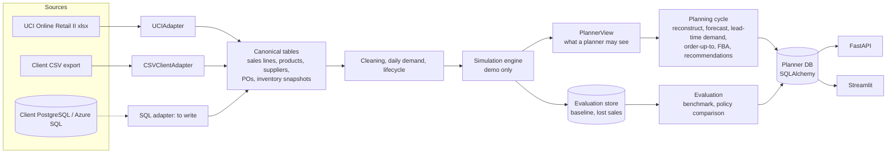

# Architecture

## Layers

| Layer | Package | Knows about |
|---|---|---|
| Adapters | `adapters/` | One source system each; produce canonical frames (`domain/contract.py`) |
| Demand | `demand/` | Cleaning, daily series, lifecycle, segmentation, stockout reconstruction |
| Forecasting | `forecasting/` | Models, rolling-origin backtest, selection, error tables, seasonal prior |
| Inventory | `inventory/` | Lead-time distributions, lead-time demand, projection |
| Replenishment | `replenishment/` | The planning cycle, order quantities, recommendations |
| Optimization | `optimization/` | Container mix behind a solver interface |
| Economics | `economics/` | Portfolio KPIs and impact |
| Simulation | `simulation/` | The demo business, the daily engine, the Legacy and QStats policies |
| Evaluation | `evaluation/` | Reads hidden demand to score: benchmark, comparison, calibration |
| Services | `services/` | Repository (database access) and the scenario simulator |
| API / UI | `api/`, `dashboard/` | Thin layers over the services |

Rules enforced by tests: planner packages never import `evaluation`; a `PlannerView` has no
attribute that reaches baseline demand, lost sales or future arrival dates; scrambling demand
after a date changes no decision made before it; a forked world equals a straight-through run.

## One planning code path

`replenishment/policy.run_cycle` is the planning cycle. The simulation calls it every week to run
World Q; the live plan calls it once on today's state; the scenario simulator calls it with other
settings. What was backtested is what runs.

## Database

SQLAlchemy Core with portable types (`domain/tables.py`); the URL comes from `config/demo.yaml` or
`QSTATS_DATABASE_URL`. SQLite for the demo; a PostgreSQL or Azure SQL URL creates the same tables.
Tables: `products`, `suppliers`, `locations`, `purchase_orders`, `lead_time_observations`,
`demand_observations`, `inventory_snapshots`, `plan_recommendations`, `recommendation_overrides`,
`plan_*` (outputs of a planning cycle), `eval_*` (the simulation's evaluation layer, read only by
the evidence pages).

## Batch, not streaming

Replenishment is a weekly decision. The pipeline is a set of batch scripts (`Makefile`); no queue,
cluster or cache is needed at this scale. A full demo run takes about five minutes on a laptop, of
which the policy comparison (16 variants × 3 replicate worlds plus two sensitivity worlds,
8 processes) is about three.
