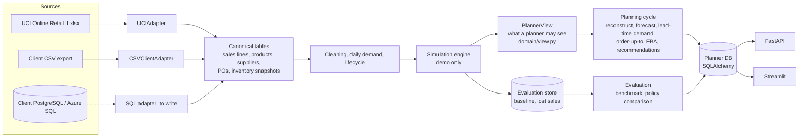

# Architecture

## Layers

| Layer | Package | Knows about |
|---|---|---|
| Adapters | `adapters/` | One source system each; produce canonical frames (`domain/contract.py`) |
| Demand | `demand/` | Cleaning, daily series, lifecycle, segmentation, stockout reconstruction |
| Forecasting | `forecasting/` | Models, rolling-origin backtest, selection, error tables, seasonal prior |
| Inventory | `inventory/` | Lead-time distributions, lead-time demand, projection |
| Replenishment | `replenishment/` | The planning cycle, order quantities, recommendations |
| Optimization | `optimization/` | Container mix behind a solver interface |
| Economics | `economics/` | Portfolio KPIs and impact |
| Simulation | `simulation/` | The demo business, the daily engine, the Legacy and QStats policies |
| Evaluation | `evaluation/` | Reads hidden demand to score: benchmark, comparison, calibration |
| Services | `services/` | Repository (database access) and the scenario simulator |
| API / UI | `api/`, `dashboard/` | Thin layers over the services |

Rules enforced by tests: planner packages (`demand`, `forecasting`, `inventory`, `replenishment`,
`optimization`, `economics`, `domain`) import neither `simulation` nor `evaluation`; the two
replayed planners (`simulation/policies`) take only the `Decisions` container from the engine; no
module outside `adapters/uci.py` names a UCI column; a `PlannerView` has no attribute that reaches
baseline demand, lost sales or future arrival dates; scrambling demand after a date changes no
decision made before it, for the Legacy and the QStats planner; a forked world equals a
straight-through run.

`PlannerView` (in `domain/`) is the planner's only input. Today only the simulation engine builds
one; a client deployment needs a constructor that builds it from the client's tables (not written
yet, see `client_onboarding.md`).

## One planning code path

`replenishment/policy.run_cycle` is the planning cycle. The simulation calls it every week to run
World Q; the live plan calls it once on today's state; the scenario simulator calls it with other
settings. What was backtested is what runs, with three differences worth knowing:

- **Refits.** In the replay, segments, champions and the error tables are refitted every four weeks
  (`reselect_every_weeks`); in between, the week's plan reuses them with fresh data. The live plan
  refits once.
- **Hysteresis.** A replayed refit keeps the incumbent champion unless the new pick is 5% better.
  The live plan is a fresh selection with no incumbent, so it can differ from the champion the
  replay would have held that week.
- **Calendar.** In the replay, the planner's future trading days come from the realised calendar
  up to the end of the data, so a closure in the coming weeks is known in advance. The live plan
  projects future trading days from the observed pattern (`calendar` in the config). Closures are
  regular here (Saturdays, the year-end shutdown, Easter), so this matters little, but it is a
  look-ahead the live plan does not have.

In both, the backtest that chooses champions and sizes errors runs on a reconstruction that uses
only data before each stockout (as the estimate stood on the day), while the forecast itself uses
the two-sided reconstruction as of the plan date. The weekly forecast bands shown with a plan use errors of the single week at each distance
ahead; orders use errors of total demand over lead time + review.

## Database

SQLAlchemy Core with portable types (`domain/tables.py`); the URL comes from `config/demo.yaml` or
`QSTATS_DATABASE_URL`. SQLite for the demo; a PostgreSQL or Azure SQL URL creates the same tables.
Tables: `products`, `suppliers`, `locations`, `purchase_orders`, `lead_time_observations`,
`demand_observations`, `inventory_snapshots`, `plan_recommendations`, `recommendation_overrides`,
`plan_*` (outputs of a planning cycle), `eval_*` (the simulation's evaluation layer, read only by
the evidence pages).

## Batch, not streaming

Replenishment is a weekly decision. The pipeline is a set of batch scripts (`Makefile`); no queue,
cluster or cache is needed at this scale. The policy comparison (21 variants × 3 replicate worlds plus two
sensitivity worlds) runs in parallel processes, each building its own world (about 1 GB); the
default is min(8, CPUs, memory / 1.2 GB), and `QSTATS_WORKERS` or `make demo WORKERS=n` sets it. Intermediate simulation state (each world's engine) is
pickled between scripts; the pickles are regenerated by the pipeline and are not a storage format.
